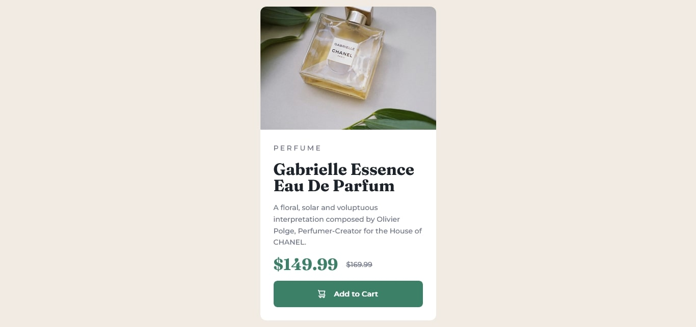

# Frontend Mentor - Product preview card component solution

This is a solution to the [Product preview card component challenge on Frontend Mentor](https://www.frontendmentor.io/challenges/product-preview-card-component-GO7UmttRfa). Frontend Mentor challenges help you improve your coding skills by building realistic projects. 

## Table of contents

- [Overview](#overview)
  - [The challenge](#the-challenge)
  - [Screenshot](#screenshot)
  - [Links](#links)
- [My process](#my-process)
  - [Built with](#built-with)
  - [What I learned](#what-i-learned)
  - [Useful resources](#useful-resources)
- [Author](#author)

## Overview

### The challenge

Users should be able to:

- View the optimal layout depending on their device's screen size
- See hover and focus states for interactive elements

### Screenshot

### Links

- Solution URL: [Add solution URL here](https://your-solution-url.com)
- Live Site URL: [Add live site URL here](https://your-live-site-url.com)

## My process

### Built with

- Semantic HTML5 markup
- Tailwindcss
- Mobile-first workflow

### What I learned

Well, this is my very first Frontend Mentor challenge, and it happened to coincide with my discovery of Tailwindcss. Naturally, I decided to use the framework for this project. You know, for something that looks so easy, it was a lot of going back-and-forth between VSCode, Tailwindcss docs, StackOverflow and other sites. It was also while working on this project that I got familiar with flexbox in CSS. 

### Useful resources

- [Tailwindcss docs](https://tailwindcss.com/docs/) 
- [Flexbox article](https://www.freecodecamp.org/news/understanding-flexbox-everything-you-need-to-know-b4013d4dc9af/) - Helped me a lot in getting acquainted with flexbox.

## Author

- Frontend Mentor - [@EmmyP77](https://www.frontendmentor.io/profile/EmmyP77)
- Twitter - [@MasterEm777](https://twitter.com/MasterEm777)
